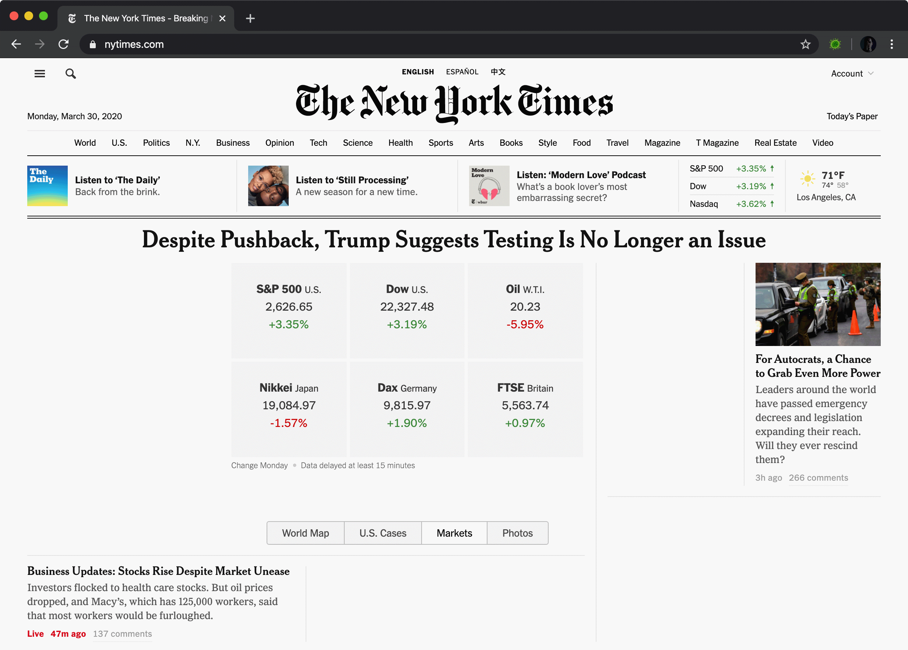

# COVID Pause

This extension removes content from websites that contain the following keywords:

* "COVID"
* "corona" or "virus",
* "quarantine"
* "pandemic"

Additional words may be added at the top of `content.js` as appropriate.

Some special cases are handled on some of the most popular English-language websites to remove content at the card/article level, instead of removing the text alone.

## Install

1. Download this file and unzip.
2. Go to [chrome://extensions/](chrome://extensions/)
3. At the top right, click "Developer mode" to enable unpacked extensions.
4. Click the "Load Unpacked" button at the top left.
5. Select the unzipped folder.

## Usage

To temporarily enable/disable COVID Pause:

1. Right-click on the page or right-click on the extension icon.
2. Select "Enable COVID Pause" or "Disable COVID Pause" as appropriate.